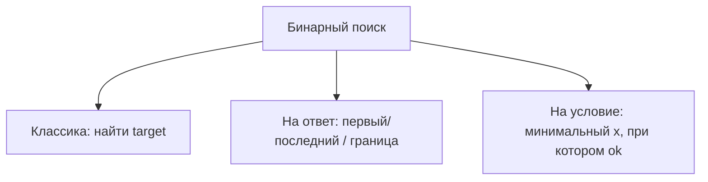

# Бинарный поиск (Binary Search)

!!! info "Зачем эта тема"
    **Бинарный поиск** — способ за **O(log n)** найти элемент или **границу** в отсортированных (или «монотонных») данных. На собеседовании часто путают «найти элемент» и «найти первое/последнее вхождение» — это разные шаблоны.

!!! tip "Задачи roadmap (10)"
    - [Binary Search](https://leetcode.com/problems/binary-search/) (easy)
    - [Search Insert Position](https://leetcode.com/problems/search-insert-position/description/) (easy)
    - [First Bad Version](https://leetcode.com/problems/first-bad-version/description/?envType=problem-list-v2&envId=binary-search) (easy)
    - [Sqrt(x)](https://leetcode.com/problems/sqrtx/description/) (easy)
    - [Valid Perfect Square](https://leetcode.com/problems/valid-perfect-square/description/) (easy)
    - [Find First and Last Position of Element in Sorted Array](https://leetcode.com/problems/find-first-and-last-position-of-element-in-sorted-array/description/) (medium)
    - [Search a 2D Matrix](https://leetcode.com/problems/search-a-2d-matrix/?envType=problem-list-v2&envId=binary-search) (medium)
    - [Find Peak Element](https://leetcode.com/problems/find-peak-element/description/?envType=problem-list-v2&envId=binary-search) (medium)
    - [Capacity To Ship Packages Within D Days](https://leetcode.com/problems/capacity-to-ship-packages-within-d-days/description/) (medium)
    - [Search in Rotated Sorted Array](https://leetcode.com/problems/search-in-rotated-sorted-array/description/?envType=problem-list-v2&envId=binary-search) (medium)

---

## Синтаксис JavaScript: шаблоны цикла

```javascript
// Безопасный mid (не переполнится в Java/C++)
const mid = left + Math.floor((right - left) / 2);

// Стиль 1: [left, right] — классический поиск
let left = 0, right = nums.length - 1;
while (left <= right) { /* left = mid + 1 или right = mid - 1 */ }

// Стиль 2: [left, right) — lower bound
let left = 0, right = nums.length;
while (left < right) {
  const mid = left + Math.floor((right - left) / 2);
  if (nums[mid] < target) left = mid + 1;
  else right = mid;        // не mid - 1!
}
return left;               // первый >= target

// Бинарный поиск по ответу
let lo = minAnswer, hi = maxAnswer;
while (lo < hi) {
  const mid = lo + Math.floor((hi - lo) / 2);
  if (can(mid)) hi = mid;
  else lo = mid + 1;
}
return lo;
```

---

**Условие:** массив **отсортирован**, нужно найти `target`.

```javascript
function binarySearch(nums, target) {
  let left = 0;
  let right = nums.length - 1;

  while (left <= right) {
    const mid = left + Math.floor((right - left) / 2);
    if (nums[mid] === target) return mid;
    if (nums[mid] < target) left = mid + 1;
    else right = mid - 1;
  }
  return -1;
}
```

| | |
|---|---|
| Время | O(log n) |
| Память | O(1) |

**Почему `left + (right - left) / 2`:** `(left + right) / 2` может переполниться в других языках; в JS реже, но привычка полезна.

**Инвариант:** ответ (если есть) всегда в диапазоне `[left, right]`.

---

## Три типа задач на бинарный поиск



### Тип 1: Классический — элемент есть / нет

Binary Search, Search a 2D Matrix (сведение к 1D), Search in Rotated Sorted Array (с модификацией).

### Тип 2: Lower / Upper bound — граница в отсортированном массиве

**Search Insert Position** — индекс, куда вставить `target`:

```javascript
function searchInsert(nums, target) {
  let left = 0, right = nums.length; // right = n, полуинтервал [0, n)

  while (left < right) {
    const mid = left + Math.floor((right - left) / 2);
    if (nums[mid] < target) left = mid + 1;
    else right = mid;
  }
  return left; // первое место, где nums[left] >= target
}
```

**Find First and Last Position:** два бинарных поиска — `lowerBound(target)` и `upperBound(target) - 1`.

| Функция | Возвращает |
|---------|------------|
| `lowerBound(x)` | первый индекс, где `nums[i] >= x` |
| `upperBound(x)` | первый индекс, где `nums[i] > x` |

### Тип 3: Бинарный поиск по **ответу** (answer space)

Не ищем индекс в массиве, а **минимальное / максимальное значение X**, при котором выполняется условие `ok(X)`.

**Признаки:**

- «Минимальная скорость / ёмкость / дней, при которой возможно…»
- «Найти sqrt / корень»
- При увеличении X условие `ok(X)` **монотонно**: сначала false…false, потом true…true (или наоборот)

**Sqrt(x), Valid Perfect Square, Capacity To Ship Packages, First Bad Version** — все этого типа.

```javascript
function shipWithinDays(weights, days) {
  let lo = Math.max(...weights); // минимум — самый тяжёлый посыл
  let hi = weights.reduce((a, b) => a + b, 0); // максимум — всё за 1 день

  function can(capacity) {
    let d = 1, cur = 0;
    for (const w of weights) {
      if (cur + w > capacity) {
        d++;
        cur = 0;
      }
      cur += w;
    }
    return d <= days;
  }

  while (lo < hi) {
    const mid = lo + Math.floor((hi - lo) / 2);
    if (can(mid)) hi = mid;
    else lo = mid + 1;
  }
  return lo;
}
```

**First Bad Version:** `isBadVersion(mid)` — монотонно: good…good, bad…bad. Ищем **первый** bad → lower bound.

---

## Search in Rotated Sorted Array

Массив был отсorted, потом **сдвинут**: `[4,5,6,7,0,1,2]`.

На каждом шаге **одна половина** `[left..mid]` или `[mid..right]` — всё ещё отсортирована.

```javascript
function search(nums, target) {
  let left = 0, right = nums.length - 1;

  while (left <= right) {
    const mid = left + Math.floor((right - left) / 2);
    if (nums[mid] === target) return mid;

    if (nums[left] <= nums[mid]) {
      // левая половина отсортирована
      if (nums[left] <= target && target < nums[mid]) right = mid - 1;
      else left = mid + 1;
    } else {
      // правая половина отсортирована
      if (nums[mid] < target && target <= nums[right]) left = mid + 1;
      else right = mid - 1;
    }
  }
  return -1;
}
```

---

## Search a 2D Matrix

Матрица: каждая **строка** отсортирована, первый элемент строки > последний предыдущей.

**Трюк:** считать матrix **одним** отсортированным массивом длины `m * n`:

```javascript
const index = row * n + col;
// mid → row = Math.floor(mid / n), col = mid % n
```

---

## Find Peak Element

**Пик** — элемент больше соседей. Массив **не** обязан быть полностью отсортирован.

Если `nums[mid] < nums[mid + 1]`, пик **справа** → `left = mid + 1`.  
Иначе пик **слева или mid** → `right = mid`.

```javascript
function findPeakElement(nums) {
  let left = 0, right = nums.length - 1;
  while (left < right) {
    const mid = left + Math.floor((right - left) / 2);
    if (nums[mid] < nums[mid + 1]) left = mid + 1;
    else right = mid;
  }
  return left;
}
```

---

## Два стиля цикла — не путать

| Стиль | Границы | Условие цикла | Когда |
|-------|---------|---------------|-------|
| Закрытый `[left, right]` | `left=0, right=n-1` | `left <= right` | классический поиск |
| Полуоткрытый `[left, right)` | `left=0, right=n` | `left < right` | lower bound, минимальный ok |

Выберите **один** стиль и придерживайтесь его — смешивание частая ошибка.

---

## Когда бинарный поиск применим

| Да | Нет |
|----|-----|
| Отсортированный массив | Нужен полный перебор всех пар |
| Монотонная функция `ok(x)` | Нет структуры «сначала нет, потом да» |
| O(log n) вместо O(n) | Данные меняются после каждого запроса без пересортировки |

---

## Типичные ошибки

| Ошибка | Как правильно |
|--------|----------------|
| `right = mid` vs `mid - 1` | Зависит от стиля; при `[left,right)` часто `right = mid` |
| Бесконечный цикл | При `left < right` и `right = mid` используй `left = mid + 1` в другой ветке |
| Бинарный поиск на неотсортированном без идеи | Нужен rotated / peak / answer space |
| Забыть lo/hi для answer space | lo = минимально возможный, hi = максимально возможный |

---

## Что сказать на собеседовании

> «Данные отсортированы — бинарный поиск за O(log n). Ищу lower bound: полуинтервал [0, n), при nums[mid] < target сдвигаю left, иначе right = mid. Для задачи на минимальную ёмкость бинарю по ответу и проверяю feasibility за O(n).»

---

## Связанные материалы

- [Подсчёт сложности](complexity.md) — O(log n)
- [Два указателя](two-pointers.md) — Two Sum II на отсортированном массиве (альтернатива BS)
- [Сортировки](sorting.md) — перед BS массив часто нужно отсортировать
