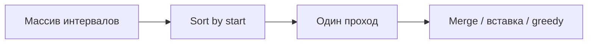

# Интервалы (Intervals)

!!! info "Зачем эта тема"
    Задачи на **интервалы** — это почти всегда: **отсортировать по началу** (или концу) + **один проход** с merge или greedy. Три задачи roadmap покрывают 90% паттерна.

!!! tip "Задачи roadmap (3)"
    - [Merge Intervals](https://leetcode.com/problems/merge-intervals/description/) (medium)
    - [Insert Interval](https://leetcode.com/problems/insert-interval/description/) (medium)
    - [Non-overlapping Intervals](https://leetcode.com/problems/non-overlapping-intervals/description/) (medium)

---

## Синтаксис JavaScript: работа с интервалами

```javascript
// Деструктуризация
const [start, end] = intervals[i];
const last = res.at(-1);           // последний интервал в результате
last[1] = Math.max(last[1], end);  // мутировать end

// Сортировка
intervals.sort((a, b) => a[0] - b[0]);  // по началу
intervals.sort((a, b) => a[1] - b[1]);  // по концу (greedy)

// Копия без мутации входа
const sorted = [...intervals].sort((a, b) => a[0] - b[0]);

// Перекрытие
const overlap = a[0] <= b[1] && b[0] <= a[1];
```

---

```javascript
// [start, end] — включительно оба конца (так на LeetCode)
const interval = [1, 5]; // от 1 до 5 включительно
```

**Перекрытие** двух интервалов `[a1, a2]` и `[b1, b2]`:

```
пересекаются ⟺ a1 <= b2 && b1 <= a2
```

На числовой прямой:

```
  a1 ---- a2
       b1 ---- b2   ← пересекаются
```

---

## Общий алгоритм: sort + linear scan



**Почему sort по start:** после сортировки новый интервал **пересекается** только с последним в результате (или с ближайшими), не нужно смотреть на все предыдущие.

| Этап | Сложность |
|------|-----------|
| Сортировка | O(n log n) |
| Проход | O(n) |
| Память | O(n) на результат (или O(1) если in-place) |

---

## Паттерн 1: Merge Intervals

**Задача:** объединить все пересекающиеся интервалы.

```javascript
function merge(intervals) {
  intervals.sort((a, b) => a[0] - b[0]);
  const res = [intervals[0]];

  for (let i = 1; i < intervals.length; i++) {
    const [s, e] = intervals[i];
    const last = res.at(-1);

    if (s <= last[1]) {
      last[1] = Math.max(last[1], e); // расширяем конец
    } else {
      res.push([s, e]);
    }
  }
  return res;
}
```

**Логика:** если `start текущего <= end последнего в res` — они сливаются, иначе начинаем новый блок.

**Пример:**

```
[[1,3],[2,6],[8,10],[15,18]]
  → sort уже по start
  → [1,6], [8,10], [15,18]
```

---

## Паттерн 2: Insert Interval

**Задача:** в **отсортированный** список непересекающихся интервалов вставить `newInterval`, сливая при необходимости.

**Три фазы** одним проходом:

1. Добавить все интервалы, которые **заканчиваются до** `newInterval.start`
2. **Слить** все пересекающиеся с `newInterval`, расширяя его
3. Добавить все интервалы, которые **начинаются после** `newInterval.end`

```javascript
function insert(intervals, newInterval) {
  const res = [];
  let i = 0;
  const n = intervals.length;
  const [ns, ne] = newInterval;

  while (i < n && intervals[i][1] < ns) {
    res.push(intervals[i++]);
  }
  while (i < n && intervals[i][0] <= ne) {
    newInterval[0] = Math.min(newInterval[0], intervals[i][0]);
    newInterval[1] = Math.max(newInterval[1], intervals[i][1]);
    i++;
  }
  res.push(newInterval);
  while (i < n) res.push(intervals[i++]);

  return res;
}
```

**Альтернатива:** `merge([...intervals, newInterval])` — проще код, та же сложность.

---

## Паттерн 3: Non-overlapping Intervals (greedy)

**Задача:** минимальное число интервалов **удалить**, чтобы остальные не пересекались.

**Жадность:** сортируем по **концу** интервала (`end`). Берём интервал с **ранним концом** — оставляем максимум места для следующих.

```javascript
function eraseOverlapIntervals(intervals) {
  intervals.sort((a, b) => a[1] - b[1]);
  let count = 0;
  let prevEnd = -Infinity;

  for (const [s, e] of intervals) {
    if (s >= prevEnd) {
      prevEnd = e; // не пересекается — оставляем
    } else {
      count++; // пересекается — «удаляем» текущий (жадно)
    }
  }
  return count;
}
```

**Эквивалентная формулировка:** максимум **непересекающихся** интервалов = `n - eraseOverlapIntervals`.

| Сортировка | Когда |
|------------|-------|
| По **start** | merge, insert |
| По **end** | максимум непересекающихся, минимум удалений |

---

## Как отличить задачу на интервалы

| Признак | Паттерн |
|---------|---------|
| «Объединить пересекающиеся» | merge после sort by start |
| «Вставить новый отрезок» | insert / merge |
| «Минимум удалить / максимум непересекающихся» | greedy, sort by end |
| «Есть ли пересечение двух отрезков времени» | `a1 <= b2 && b1 <= a2` |
| «Точки на прямой, покрытие» | часто sort + sweep line (medium+) |

---

## Связь с другими темами

- **Meeting Rooms** — sort by start, проверить `start[i] < end[i-1]`
- **Insert Interval** = частный merge
- **Range** задачи иногда reducible к intervals после sort событий `(time, +1/-1)`

---

## Типичные ошибки

| Ошибка | Как правильно |
|--------|----------------|
| Sort by end для merge | Для merge нужен **start** |
| `s < last[1]` vs `s <= last[1]` | При **закрытых** интервалах `[1,4]` и `[4,5]` — **смыкаются**, merge: используй `<=` |
| Мутировать входной массив | Уточни: sort мутирует; можно `[...intervals].sort()` |
| Non-overlapping: sort by start | Жадность по **end** |

---

## Что сказать на собеседовании

> «Отсортирую интервалы по началу за O(n log n). Пройду один раз: если текущий start ≤ end последнего в результате — расширяю end, иначе добавляю новый интервал. Итого O(n log n) время, O(n) память на ответ.»

---

## Связанные материалы

- [Сортировки](sorting.md)
- [Жадные алгоритмы](sorting.md) — greedy by end
- [Подсчёт сложности](complexity.md)
