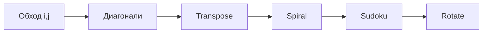

# Матрицы (2D-массивы)

!!! info "Зачем эта тема"
    **Матрица** в задачах LeetCode — это обычный **двумерный массив**: массив массивов. Та же индексация и циклы, что у одномерного массива, но появляется **вторая координата** (строка и столбец). Большинство задач сводится к 3–4 паттернам обхода.

!!! tip "Задачи roadmap (5)"
    - [Matrix Diagonal Sum](https://leetcode.com/problems/matrix-diagonal-sum/description/) (easy)
    - [Transpose Matrix](https://leetcode.com/problems/transpose-matrix/description/?envType=problem-list-v2&envId=matrix) (easy)
    - [Valid Sudoku](https://leetcode.com/problems/valid-sudoku/?envType=problem-list-v2&envId=matrix) (medium)
    - [Rotate Image](https://leetcode.com/problems/rotate-image/description/?envType=problem-list-v2&envId=matrix) (medium)
    - [Spiral Matrix](https://leetcode.com/problems/spiral-matrix/description/?envType=problem-list-v2&envId=matrix) (medium)

    Практика: `BalunRodmap/Matrix/`.

---

## Синтаксис JavaScript: матрицы

```javascript
const matrix = [[1, 2], [3, 4]];
const m = matrix.length;           // число строк
const n = matrix[0].length;        // число столбцов
const val = matrix[row][col];      // row = i, col = j

// Двойной цикл — стандартный обход
for (let i = 0; i < m; i++) {
  for (let j = 0; j < n; j++) {
    // matrix[i][j]
  }
}

// Создать m×n из нулей
const grid = Array.from({ length: m }, () => Array(n).fill(0));

// Копия (не shallow!)
const copy = matrix.map(row => [...row]);

// 4 соседа
const dirs = [[0,1],[0,-1],[1,0],[-1,0]];
for (const [dr, dc] of dirs) {
  const r = i + dr, c = j + dc;
  if (r >= 0 && c >= 0 && r < m && c < n) { /* ... */ }
}

// Транспонирование: result[j][i] = matrix[i][j]
```

---

Матрица размера **m × n** — это **m строк** и **n столбцов** чисел (или символов).

В JavaScript:

```javascript
const matrix = [
  [1, 2, 3],   // строка 0
  [4, 5, 6],   // строка 1
  [7, 8, 9],   // строка 2
];
// matrix[строка][столбец]
matrix[0][2]; // 3 — первая строка, третий столбец
matrix[2][1]; // 8
```

Визуально (индексы строки `i`, столбца `j`):

```
        j=0   j=1   j=2
      ┌─────┬─────┬─────┐
i=0   │  1  │  2  │  3  │
      ├─────┼─────┼─────┤
i=1   │  4  │  5  │  6  │
      ├─────┼─────┼─────┤
i=2   │  7  │  8  │  9  │
      └─────┴─────┴─────┘
```

**Запомни порядок:** сначала **строка** (`row` / `i`), потом **столбец** (`col` / `j`). В коде: `matrix[i][j]`.

| Термин | Значение |
|--------|----------|
| `m` | число строк (`matrix.length`) |
| `n` | число столбцов (`matrix[0].length`) |
| Квадратная матрица | `m === n` |

!!! note "Не путать с координатами на плоскости"
    В школе пишут (x, y) — «столбец, строка». В массивах везде **`[row][col]`** = **`[y][x]`** если смотреть как на сетку: **строка — это «вниз»**, столбец — «вправо».

---

## От одномерного массива к матрице

Если **одномерный массив** — это одна «полоска» ячеек:

```
[ 10, 20, 30, 40 ]
  0   1   2   3      ← один индекс
```

То **матрица** — несколько таких полосок, сложенных **друг под другом**:

```
строка 0:  [ 1,  2,  3 ]
строка 1:  [ 4,  5,  6 ]
строка 2:  [ 7,  8,  9 ]
```

Чтобы попасть в число `6`, нужно сказать:

1. **какая строка** — вторая, индекс `1`;
2. **какой столбец** — третий, индекс `2`.

→ `matrix[1][2] === 6`

**Аналогия:** как адрес в таблице Excel — «строка 2, столбец C». В коде оба номера с нуля.

---

## Создание матрицы в JavaScript

### Литерал (как в условии задачи)

```javascript
const grid = [
  [1, 2, 3],
  [4, 5, 6],
];
// grid.length === 2 строки
// grid[0].length === 3 столбца → матрица 2×3
```

### Пустая матрица m×n, заполненная нулями

Часто нужно **собрать ответ** заданного размера:

```javascript
const rows = 3;
const cols = 4;
const matrix = Array.from({ length: rows }, () => Array(cols).fill(0));

// [
//   [0, 0, 0, 0],
//   [0, 0, 0, 0],
//   [0, 0, 0, 0],
// ]
```

### Копия (чтобы не портить исходник)

```javascript
const copy = matrix.map(row => [...row]);
```

!!! warning "Частая ловушка"
    `const bad = matrix` — это **не копия**, а второе имя на тот же массив. Изменения в `bad` затронут `matrix`.

---

## Размеры: m, n и как их читать

```javascript
const matrix = [
  [1, 2, 3],
  [4, 5, 6],
  [7, 8, 9],
];

const m = matrix.length;      // 3 — число строк
const n = matrix[0].length;   // 3 — число столбцов в первой строке
```

| Обозначение | Формула | В примере |
|-------------|---------|-----------|
| строки `m` | `matrix.length` | 3 |
| столбцы `n` | `matrix[0].length` | 3 |
| всего ячеек | `m × n` | 9 |

**Прямоугольная** матрица (строк и столбцов разное количество):

```javascript
const rect = [
  [1, 2, 3, 4],   // 4 столбца
  [5, 6, 7, 8],
];
// 2×4 — две строки, четыре столбца
```

```
  j=0  j=1  j=2  j=3
┌────┬────┬────┬────┐
│ 1  │ 2  │ 3  │ 4  │  i=0
├────┼────┼────┼────┤
│ 5  │ 6  │ 7  │ 8  │  i=1
└────┴────┴────┴────┘
```

**Квадратная** — когда `m === n` (3×3, 4×4, 9×9 в Sudoku).

---

## Строка и столбец — разбор на пальцах

Матрица:

```javascript
const m = [
  [10, 20, 30],
  [40, 50, 60],
];
```

### Строка `i` — горизонталь

Строка `0`: `m[0]` → `[10, 20, 30]` — вся первая линия слева направо.

```javascript
// сумма строки i
let rowSum = 0;
for (let j = 0; j < m[0].length; j++) {
  rowSum += m[0][j];  // 10 + 20 + 30 = 60
}
```

### Столбец `j` — вертикаль

Столбец `1` (второй столбец): берём `m[0][1]`, `m[1][1]` → `20` и `50`.

```javascript
// сумма столбца j = 1
let colSum = 0;
for (let i = 0; i < m.length; i++) {
  colSum += m[i][1];  // 20 + 50 = 70
}
```

Визуально столбец `j=1`:

```
  j=0  j=1  j=2
┌────┬────┬────┐
│ 10 │ 20 │ 30 │
├────┼────┼────┤
│ 40 │ 50 │ 60 │
└────┴────┴────┘
       ↑
    столбец 1: 20, 50
```

| Что нужно | Цикл | Индекс фиксирован |
|-----------|------|-------------------|
| строка `i` | `j` от 0 до n-1 | `i` |
| столбец `j` | `i` от 0 до m-1 | `j` |

---

## Как «думать» индексами: три мини-примера

### Пример 1 — найти ячейку

```javascript
const matrix = [
  ['a', 'b'],
  ['c', 'd'],
];
matrix[1][0]; // 'c' — вторая строка, первый столбец
```

```
        j=0   j=1
      ┌─────┬─────┐
i=0   │  a  │  b  │
      ├─────┼─────┤
i=1   │  c  │  d  │  ← matrix[1][0] это 'c'
      └─────┴─────┘
```

### Пример 2 — изменить ячейку in-place

LeetCode часто просит менять **тот же** массив, не создавая новый:

```javascript
matrix[0][2] = 99;

// было          стало
// 1 2 3         1 2 99
// 4 5 6         4 5 6
```

### Пример 3 — обойти только углы

```javascript
const n = matrix.length; // квадрат 3×3
const corners = [
  matrix[0][0],           // левый верх
  matrix[0][n - 1],       // правый верх
  matrix[n - 1][0],       // левый низ
  matrix[n - 1][n - 1],   // правый низ
];
```

Для `3×3` углы — это `1, 3, 7, 9` в классической матрице 1..9.

---

## Соседи ячейки (важно для обходов)

Для ячейки `(i, j)` **четыре соседа** (вверх, вниз, влево, вправо):

```javascript
const directions = [
  [-1, 0], // вверх: строка -1
  [1, 0],  // вниз
  [0, -1], // влево: столбец -1
  [0, 1],  // вправо
];

for (const [di, dj] of directions) {
  const ni = i + di;
  const nj = j + dj;
  // проверка границ — иначе вылет за массив
  if (ni >= 0 && ni < rows && nj >= 0 && nj < cols) {
    const neighbor = matrix[ni][nj];
  }
}
```

```
        (i-1,j)
           ↑
(i,j-1) ← (i,j) → (i,j+1)
           ↓
        (i+1,j)
```

**Пример:** в матрице 3×3 у центра `(1,1)` соседи — `(0,1)`, `(2,1)`, `(1,0)`, `(1,2)`.
У угла `(0,0)` только два соседа — `(1,0)` и `(0,1)`.

На Easy/Medium в блоке «матрицы» чаще хватает **4 направлений**. 8 (с диагоналями) — реже.

---

## Простые операции — учимся на маленьких примерах

Матрица для примеров:

```javascript
const nums = [
  [1, -2, 3],
  [4,  5, 6],
];
```

### Сумма всех элементов

```javascript
let total = 0;
for (let i = 0; i < nums.length; i++) {
  for (let j = 0; j < nums[0].length; j++) {
    total += nums[i][j];
  }
}
// 1 + (-2) + 3 + 4 + 5 + 6 = 17
```

### Найти максимум

```javascript
let max = nums[0][0];
for (let i = 0; i < nums.length; i++) {
  for (let j = 0; j < nums[0].length; j++) {
    if (nums[i][j] > max) max = nums[i][j];
  }
}
// max === 6
```

### Посчитать отрицательные

```javascript
let count = 0;
for (let i = 0; i < nums.length; i++) {
  for (let j = 0; j < nums[0].length; j++) {
    if (nums[i][j] < 0) count++;
  }
}
// count === 1 (это -2)
```

### Построить новую матрицу по правилу

«Удвоить каждый элемент»:

```javascript
const doubled = nums.map(row => row.map(x => x * 2));
// [[2, -4, 6], [8, 10, 12]]
```

Здесь `map` по строке и по элементу — удобный способ, когда **не** требуют O(1) памяти.

---

## Пошаговый обход 2×3 (как работает двойной цикл)

```javascript
const matrix = [
  [1, 2, 3],
  [4, 5, 6],
];
```

Порядок посещения ячеек при `i` снаружи, `j` внутри:

```
Порядок обхода:
 1 →  2 →  3
 4 →  5 →  6

i=0: (0,0)=1, (0,1)=2, (0,2)=3
i=1: (1,0)=4, (1,1)=5, (1,2)=6
```

Таблица трассировки:

| шаг | `i` | `j` | `matrix[i][j]` |
|-----|-----|-----|----------------|
| 1 | 0 | 0 | 1 |
| 2 | 0 | 1 | 2 |
| 3 | 0 | 2 | 3 |
| 4 | 1 | 0 | 4 |
| 5 | 1 | 1 | 5 |
| 6 | 1 | 2 | 6 |

Всего шагов: `2 × 3 = 6` = `m × n`. Поэтому полный обход — **O(m × n)**.

---

## Как в задачах LeetCode передают матрицу

Типичный формат в условии:

```text
Вход: matrix = [[1,2,3],[4,5,6],[7,8,9]]
```

В функции:

```javascript
function someTask(matrix) {
  const rows = matrix.length;
  const cols = matrix[0].length;
  // ...
}
```

**Sudoku** — массив строк, каждая строка — массив символов:

```javascript
const board = [
  ["5","3",".",".","7",".",".",".","."],
  ["6",".",".","1","9","5",".",".","."],
  // ... всего 9 строк по 9 символов
];
board[0][2]; // "." — пустая клетка
```

**Важно:** в одной задаче все строки обычно **одинаковой длины**. На собеседовании можно уточнить: «Можно ли считать прямоугольник ровным?» — почти всегда да.

---

## In-place vs новая матрица

| Требование в задаче | Что делать |
|---------------------|------------|
| «Modify matrix in-place» | менять `matrix[i][j]` напрямую |
| «Return a new matrix» | создать `result` через `Array.from` / `map` |
| «Return an array» (Spiral) | одномерный `out[]`, матрицу не обязательно строить |

**Пример in-place** — удвоить только диагональ квадрата 3×3:

```javascript
for (let i = 0; i < matrix.length; i++) {
  matrix[i][i] *= 2;
}
// 5 на главной диагонали станет 10, остальное без изменений
```

---

## Связь с одномерным массивом (для интуиции)

Иногда матрицу `m × n` мысленно «разворачивают» в длинный массив длины `m*n` — как пиксели на экране. В **большинстве** задач LeetCode из блока Matrix это **не нужно**, но формула полезна для понимания:

```
индекс в 1D = i * n + j   (строка i, столбец j, n столбцов)
```

Пример 2×3, элемент `6` на позиции `(1, 2)`:

```
1D: [ 1, 2, 3, 4, 5, 6 ]
              индекс = 1*3 + 2 = 5
```

На собеседовании для Easy/Medium матриц **достаточно** `matrix[i][j]` без перевода в 1D.

---

## Базовый обход: два вложенных цикла

Самый частый шаблон — пройти **каждую ячейку** один раз.

```javascript
for (let i = 0; i < matrix.length; i++) {
  for (let j = 0; j < matrix[0].length; j++) {
    // работа с matrix[i][j]
  }
}
```

**Сложность:** **O(m × n)** — время; **O(1)** доп. памяти, если не создаёшь новые структуры.

Когда достаточно двух циклов:

- посчитать сумму / максимум / количество;
- проверить каждую ячейку по условию;
- построить новую матрицу по правилу из старой (transpose).

---

## Пять главных паттернов

На собеседовании матрицы почти всегда — один из этих приёмов.

### 1. По строкам и столбцам (линейный обход)

Идёшь **строка за строкой** или **столбец за столбцом**.

```
→ → →   обход по строкам (i фиксирован, j бежит)
↓ ↓ ↓   обход по столбцам (j фиксирован, i бежит)
```

**Где встречается:** любая задача «пройти всю матрицу», Transpose Matrix, проверка строк в Sudoku.

---

### 2. Диагонали

**Главная диагональ** (слева-сверху → справа-снизу): индексы растут **одинаково**.

```
[0][0]  [1][1]  [2][2]
```

Правило: `matrix[i][i]` при `i` от `0` до `min(m, n) - 1`.

**Побочная диагональ** (справа-сверху → слева-снизу): сумма индексов **постоянна**.

```
Для 3×3: i + j === 2
[0][2]  [1][1]  [2][0]
```

Общая формула для квадрата n×n: `i + j === n - 1`.

```
        j=0   j=1   j=2
      ┌─────┬─────┬─────┐
i=0   │  \  │     │  /  │   \ — главная, / — побочная
      ├─────┼─────┼─────┤
i=1   │     │  X  │     │   X — обе диагонали пересекаются
      ├─────┼─────┼─────┤
i=2   │  /  │     │  \  │
      └─────┴─────┴─────┘
```

**Где встречается:** Matrix Diagonal Sum (сумма главной + побочной, центр не считать дважды).

---

### 3. Транспонирование (строки ↔ столбцы)

**Транспонированная** матрица: элемент `[i][j]` становится `[j][i]`.

```
Исходная          Транспонированная
1  2  3           1  4  7
4  5  6    →      2  5  8
7  8  9           3  6  9
```

Код-идея:

```javascript
result[j][i] = matrix[i][j];
```

Для **квадратной** матрицы можно менять местами **in-place** (swap по диагонали), для прямоугольной — нужен новый массив или аккуратная запись.

**Где встречается:** Transpose Matrix; также **половина** решения Rotate Image.

---

### 4. Поворот на 90° (слои и пары)

Поворот **по часовой стрелке на 90°** для квадрата n×n часто делают в **два шага**:

1. **Транспонировать** (отразить относительно главной диагонали).
2. **Развернуть каждую строку** (как Reverse String).

```
1 2 3      1 4 7      7 4 1
4 5 6  →   2 5 8  →   8 5 2
7 8 9      3 6 9      9 6 3
```

Альтернатива: крутить **по слоям** (внешнее кольцо, потом внутреннее) — четыре ячейки за раз через `swap`.

**Где встречается:** Rotate Image (in-place, квадрат).

---

### 5. Спиральный обход (границы)

Обход **по периметру**, затем сужаем «рамку» внутрь.

Держим четыре границы:

- `top`, `bottom` — верхняя и нижняя строка;
- `left`, `right` — левый и правый столбец.

```
Шаг 1: →→→  верхняя строка (left → right)
Шаг 2: ↓↓↓  правый столбец (top+1 → bottom)
Шаг 3: ←←←  нижняя строка (right-1 → left), если top < bottom
Шаг 4: ↑↑↑  левый столбец (bottom-1 → top+1), если left < right
```

Потом: `top++`, `bottom--`, `left++`, `right--` и повтор, пока границы не пересекутся.

```
1 → 2 → 3
        ↓
4 → 5   6
↑       ↓
7 ← 8 ← 9
```

**Где встречается:** Spiral Matrix (собрать элементы в массив / строку).

---

## Valid Sudoku: не геометрия, а «группы»

Sudoku — хороший пример: матрица 9×9, нужно проверить **три типа групп** без полного перебора «всех с всех»:

| Группа | Как проверять |
|--------|----------------|
| Строка `i` | 9 ячеек в `board[i][0..8]` |
| Столбец `j` | 9 ячеек в `board[0..8][j]` |
| Блок 3×3 | ячейки в квадрате; индекс блока: `boxRow = 3 * Math.floor(i / 3)`, `boxCol = 3 * Math.floor(j / 3)` |

Для каждой группы: цифра `1–9` встречается **не больше одного раза**. Пустая клетка `.` пропускается.

Типичная структура: `Set` на строку, `Set` на столбец, `Set` на блок — или один проход с тремя массивами Set.

```
Блоки 3×3 (номера для понимания):
┌───┬───┬───┐
│ 0 │ 1 │ 2 │
├───┼───┼───┤
│ 3 │ 4 │ 5 │
├───┼───┼───┤
│ 6 │ 7 │ 8 │
└───┴───┴───┘
```

Ячейка `(i, j)` лежит в блоке: `Math.floor(i/3) * 3 + Math.floor(j/3)`.

---

## Связь задач из roadmap с паттернами

| Задача | Сложность | Паттерн | Суть |
|--------|-----------|---------|------|
| Matrix Diagonal Sum | Easy | Диагонали | Один цикл по `i`: `matrix[i][i]` + `matrix[i][n-1-i]`; при нечётном n центр один раз |
| Transpose Matrix | Easy | Транспонирование | `result[j][i] = matrix[i][j]` или swap in-place для квадрата |
| Valid Sudoku | Medium | Строки / столбцы / блоки | Set или массив флагов на группу |
| Rotate Image | Medium | Транспонирование + reverse строк | Или поворот по слоям (4 swap) |
| Spiral Matrix | Medium | Границы top/bottom/left/right | Обход по периметру, сужение рамки |

---

## Как читать условие и выбрать подход

| Признак в условии | Вероятный паттерн |
|-------------------|-------------------|
| Сумма / элементы на диагонали | главная и/или побочная диагональ |
| Поменять строки и столбцы местами | transpose |
| Повернуть квадрат на 90° / 180° | transpose + reverse или слои |
| Обойти «улиткой», по спирали | четыре границы |
| Проверить дубликаты в строке/столбце/регионе | Set на группу, один проход |
| Квадратная матрица n×n, in-place | часто swap по диагонали или по кольцам |

---

## Типичные ошибки

| Ошибка | Как правильно |
|--------|----------------|
| Путать `[i][j]` и `[j][i]` | Первый индекс — **строка**, второй — **столбец** |
| Забыть `matrix[0].length` для столбцов | Строк может быть `m`, столбцов — `n`; не всегда квадрат |
| Дважды считать центр на диагоналях | При нечётном n: `matrix[mid][mid]` один раз |
| В спирали не сужать границы | После каждого кольца: `top++`, `bottom--`, `left++`, `right--` |
| В спирали дублировать углы | Верхняя строка: `left → right`; правая колонка: `top+1 → bottom` |
| Rotate: менять несимметрично | Транспонирование + reverse **всех** строк, не одной |
| Sudoku: проверять только строки | Нужны ещё столбцы и блоки 3×3 |

---

## Шпаргалка сложности

| Операция | Время | Память |
|----------|-------|--------|
| Полный обход m×n | O(m × n) | O(1) |
| Transpose (новая матрица) | O(m × n) | O(m × n) на ответ |
| Transpose in-place (квадрат) | O(n²) | O(1) |
| Диагонали квадрата n×n | O(n) | O(1) |
| Spiral / Rotate | O(n²) | O(1) или O(n²) на ответ |
| Valid Sudoku 9×9 | O(81) = O(1) | O(1) с фиксированными Set |

Для LeetCode **n ≤ 300** или **9×9** полный обход всегда укладывается в лимиты.

---

## Мини-шаблоны на JavaScript

### Обход всех ячеек

```javascript
const rows = matrix.length;
const cols = matrix[0].length;

for (let i = 0; i < rows; i++) {
  for (let j = 0; j < cols; j++) {
    const cell = matrix[i][j];
  }
}
```

### Главная + побочная диагональ (квадрат n×n)

```javascript
let sum = 0;
const n = matrix.length;

for (let i = 0; i < n; i++) {
  sum += matrix[i][i];           // главная
  sum += matrix[i][n - 1 - i];   // побочная
}

// центр посчитан дважды при нечётном n
if (n % 2 === 1) {
  sum -= matrix[Math.floor(n / 2)][Math.floor(n / 2)];
}
```

### Транспонирование в новую матрицу

```javascript
const rows = matrix.length;
const cols = matrix[0].length;
const result = Array.from({ length: cols }, () => Array(rows));

for (let i = 0; i < rows; i++) {
  for (let j = 0; j < cols; j++) {
    result[j][i] = matrix[i][j];
  }
}
```

### Спираль: границы

```javascript
let top = 0, bottom = rows - 1;
let left = 0, right = cols - 1;
const out = [];

while (top <= bottom && left <= right) {
  for (let j = left; j <= right; j++) out.push(matrix[top][j]);
  top++;

  for (let i = top; i <= bottom; i++) out.push(matrix[i][right]);
  right--;

  if (top <= bottom) {
    for (let j = right; j >= left; j--) out.push(matrix[bottom][j]);
    bottom--;
  }

  if (left <= right) {
    for (let i = bottom; i >= top; i--) out.push(matrix[i][left]);
    left++;
  }
}
```

---

## Порядок изучения (рекомендация)

```
Обход i,j  →  Диагонали  →  Transpose  →  Spiral  →  Sudoku  →  Rotate
```



1. **Matrix Diagonal Sum** — привыкнуть к `matrix[i][i]` и `matrix[i][n-1-i]`.
2. **Transpose Matrix** — понять swap строки/столбца.
3. **Spiral Matrix** — четыре границы, аккуратность с углами.
4. **Valid Sudoku** — группировка + Set, не геометрия.
5. **Rotate Image** — transpose + reverse или слои.

---

## Что сказать на собеседовании

1. Назвать размер: «матрица **m × n**, обхожу за **O(mn)**».
2. Уточнить индексацию: «`matrix[row][col]`».
3. Для поворота: «транспонирую и разворачиваю каждую строку — два прохода, **O(n²)**, **O(1)** доп. памяти in-place».
4. Для спирали: «держу top, bottom, left, right, на каждом шаге сужаю рамку».

**Пример:**

> «Квадрат n×n. Сначала отражаю относительно главной диагонали — `swap(matrix[i][j], matrix[j][i])` для `j > i`. Потом разворачиваю каждую строку двумя указателями. Итого O(n²) время, O(1) память.»

---

## Связанные материалы

- [Подсчёт сложности](complexity.md) — почему двойной цикл по матрице это O(n²)
- [Два указателя](two-pointers.md) — reverse строки при повороте матрицы
- `roadmap.md` — задачи с матрицами и отсортированными матрицами

!!! tip "После теории"
    Открой любую задачу из блока и **сначала** назови паттерн (диагональ / transpose / spiral / группы), **потом** пиши код. Так матрица перестаёт быть «новой структурой» — это просто массив с двумя индексами.
