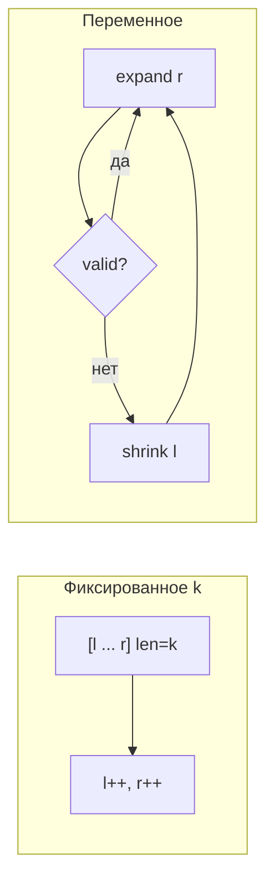

# Скользящее окно (Sliding Window)

!!! info "Зачем этот паттерн"
    **Sliding Window** — один из главных способов решить задачи на **подстроки / подмассивы** за **O(n)** вместо O(n²). Окно — это непрерывный отрезок, который «едет» по данным.

!!! tip "Задачи roadmap (5)"
    - [Longest Substring Without Repeating Characters](https://leetcode.com/problems/longest-substring-without-repeating-characters/description/?envType=problem-list-v2&envId=hash-table) (medium)
    - [Find All Anagrams in a String](https://leetcode.com/problems/find-all-anagrams-in-a-string/?envType=problem-list-v2&envId=sliding-window) (medium)
    - [Longest Harmonious Subsequence](https://leetcode.com/problems/longest-harmonious-subsequence/description/?envType=problem-list-v2&envId=sliding-window) (medium)
    - [Longest Repeating Character Replacement](https://leetcode.com/problems/longest-repeating-character-replacement/description/?envType=problem-list-v2&envId=sliding-window) (medium)
    - [Fruit Into Baskets](https://leetcode.com/problems/fruit-into-baskets/description/?envType=problem-list-v2&envId=sliding-window) (medium)

---

## Синтаксис JavaScript: окно + Map

```javascript
let left = 0;
const freq = new Map();

for (let right = 0; right < s.length; right++) {
  // расширить окно — добавить s[right]
  freq.set(s[right], (freq.get(s[right]) ?? 0) + 1);

  while (/* окно невалидно */) {
    // сжать — убрать s[left]
    freq.set(s[left], freq.get(s[left]) - 1);
    if (freq.get(s[left]) === 0) freq.delete(s[left]);
    left++;
  }

  // обновить ответ: right - left + 1
}

// Массив из 26 частот (строки a-z)
const count = new Array(26).fill(0);
count[s.charCodeAt(i) - 'a'.charCodeAt(0)]++;
```

---

| Тип | Размер окна | Когда |
|-----|-------------|-------|
| **Фиксированный** | всегда k | «найди все анаграммы длины k», «max sum subarray of size k» |
| **Переменный** | растёт / сжимается | «longest substring…», «shortest subarray with sum ≥ k» (если неотрицательные) |



---

## Шаблон: переменное окно

```javascript
function slidingWindow(s) {
  let left = 0;
  let ans = 0;
  const state = new Map(); // или объект, Set — по задаче

  for (let right = 0; right < s.length; right++) {
    // 1. Добавить s[right] в state
    add(state, s[right]);

    // 2. Сжимать, пока окно невалидно
    while (!isValid(state)) {
      remove(state, s[left]);
      left++;
    }

    // 3. Обновить ответ (max length, count, …)
    ans = Math.max(ans, right - left + 1);
  }
  return ans;
}
```

**Инвариант:** окно `[left, right]` **всегда валидно** (или наоборот — минимально валидное, зависит от задачи).

---

## Паттерн 1: Longest Substring Without Repeating Characters

**Валидность:** все символы в окне **уникальны**.

**State:** `Map` символ → последний индекс **или** Set символов в окне.

```javascript
function lengthOfLongestSubstring(s) {
  const last = new Map();
  let left = 0;
  let maxLen = 0;

  for (let right = 0; right < s.length; right++) {
    const ch = s[right];
    if (last.has(ch) && last.get(ch) >= left) {
      left = last.get(ch) + 1; // прыжок left, не по одному
    }
    last.set(ch, right);
    maxLen = Math.max(maxLen, right - left + 1);
  }
  return maxLen;
}
```

| | |
|---|---|
| Время | O(n) |
| Память | O(min(n, alphabet)) |

---

## Паттерн 2: Fixed window — Find All Anagrams in a String

Окно длины `s1.length` скользит по `s2`.

**State:** массив частот 26 букв для окна и для `s1`.

```javascript
function findAnagrams(s, p) {
  if (p.length > s.length) return [];
  const need = Array(26).fill(0);
  const window = Array(26).fill(0);
  const a = 'a'.charCodeAt(0);
  const k = p.length;
  const res = [];

  for (const ch of p) need[ch.charCodeAt(0) - a]++;

  for (let i = 0; i < s.length; i++) {
    window[s.charCodeAt(i) - a]++;
    if (i >= k) window[s.charCodeAt(i - k) - a]--;
    if (i >= k - 1 && window.every((v, j) => v === need[j])) {
      res.push(i - k + 1);
    }
  }
  return res;
}
```

**Оптимизация:** вместо `every` — счётчик `matched` букв с нужной частотой.

**Когда:** фиксированная длина, сравнение «мультимножеств» (анаграммы).

---

## Паттерн 3: At most K distinct — Fruit Into Baskets

**Условие:** не более **2** типов фруктов → обобщение: **at most K distinct** в окне.

```javascript
function totalFruit(fruits) {
  const freq = new Map();
  let left = 0;
  let maxLen = 0;

  for (let right = 0; right < fruits.length; right++) {
    freq.set(fruits[right], (freq.get(fruits[right]) ?? 0) + 1);

    while (freq.size > 2) {
      const leftFruit = fruits[left];
      freq.set(leftFruit, freq.get(leftFruit) - 1);
      if (freq.get(leftFruit) === 0) freq.delete(leftFruit);
      left++;
    }
    maxLen = Math.max(maxLen, right - left + 1);
  }
  return maxLen;
}
```

**Шаблон:** `while (distinct > K) shrink left`.

---

## Паттерн 4: Longest Repeating Character Replacement

**Условие:** можно заменить не более `k` символов → длина окна − **maxFreq** в окне ≤ k.

```javascript
function characterReplacement(s, k) {
  const freq = Array(26).fill(0);
  let left = 0;
  let maxFreq = 0;
  let maxLen = 0;
  const a = 'A'.charCodeAt(0);

  for (let right = 0; right < s.length; right++) {
    freq[s.charCodeAt(right) - a]++;
    maxFreq = Math.max(maxFreq, freq[s.charCodeAt(right) - a]);

    while ((right - left + 1) - maxFreq > k) {
      freq[s.charCodeAt(left) - a]--;
      left++;
    }
    maxLen = Math.max(maxLen, right - left + 1);
  }
  return maxLen;
}
```

**Интуиция:** окно валидно, если «лишних» символов (не самого частого) не больше k.

---

## Как понять, что задача — sliding window

| Признак | Тип окна |
|---------|----------|
| «Подстрока / подмассив» (непрерывный) | window |
| «Longest / shortest с условием» | переменное |
| «Все подстроки длины k с свойством» | фиксированное k |
| «Не более K различных» | variable + Map size |
| «Подпоследовательность» (можно пропускать) | **не** window — два указателя или DP |

!!! note "Longest Harmonious Subsequence"
    В roadmap эта задача — **subsequence** (можно пропускать элементы), не подмассив. Классическое решение: sort + scan или Map частот. Sliding window — только если ищешь **непрерывный** подмассив с max−min ≤ 1.

---

## Window vs Prefix Sum vs Two Pointers

| Задача | Паттерн |
|--------|---------|
| Подмассив с sum = k, есть отрицательные | [Prefix + Map](prefix-sum.md) |
| Подмассив с sum ≥ k, все ≥ 0 | variable window |
| Пара в отсортированном массиве | [Two pointers](two-pointers.md) с концов |
| Longest substring с ограничением | sliding window |

---

## Типичные ошибки

| Ошибка | Как правильно |
|--------|----------------|
| Window на под**последовательность** | Нужен непрерывный отрезок |
| Забыть обновить state при shrink | Удалять `s[left]` из Map |
| Off-by-one в длине | `right - left + 1` |
| Anagrams: не убрать символ, вышедший из окна | При `i >= k` декремент `window[s[i-k]]` |
| Harmonious **subsequence** через window | Subsequence — sort + two pointers или Map; window — только для **subarray** |

---

## Что сказать на собеседовании

> «Расширяю right, поддерживаю Map частот в окне [left, right]. Пока нарушено условие — сдвигаю left и убираю символы из Map. Каждый индекс входит и выходит максимум один раз — O(n) время, O(k) память на алфавит или Map.»

---

## Связанные материалы

- [Хеш-таблицы](hash-tables.md) — частоты в окне
- [Два указателя](two-pointers.md) — пересечение идей
- [Префиксные суммы](prefix-sum.md) — когда window не подходит
