# Два указателя (Two Pointers)

!!! info "Зачем этот паттерн"
    **Two pointers** — один из самых частых приёмов на алгосекции для массивов и строк. Позволяет заменить наивный перебор **O(n²)** одним проходом **O(n)** с **O(1)** дополнительной памятью (часто).

!!! tip "Задачи roadmap (12)"
    - [Reverse String](https://leetcode.com/problems/reverse-string/description/?envType=problem-list-v2&envId=two-pointers) (easy)
    - [Valid Palindrome](https://leetcode.com/problems/valid-palindrome/description/?envType=problem-list-v2&envId=two-pointers) (easy)
    - [Merge Sorted Array](https://leetcode.com/problems/merge-sorted-array?envType=problem-list-v2&envId=two-pointers) (easy)
    - [Intersection of Two Arrays](https://leetcode.com/problems/intersection-of-two-arrays/description/) (easy)
    - [Squares of a Sorted Array](https://leetcode.com/problems/squares-of-a-sorted-array/description/?envType=problem-list-v2&envId=two-pointers) (easy)
    - [Remove Duplicates from Sorted Array](https://leetcode.com/problems/remove-duplicates-from-sorted-array/description/?envType=problem-list-v2&envId=two-pointers) (easy)
    - [Move Zeroes](https://leetcode.com/problems/move-zeroes/?envType=problem-list-v2&envId=two-pointers) (easy)
    - [Two Sum II](https://leetcode.com/problems/two-sum-ii-input-array-is-sorted/description/?envType=problem-list-v2&envId=two-pointers) (medium)
    - [3Sum](https://leetcode.com/problems/3sum/description/?envType=problem-list-v2&envId=two-pointers) (medium)
    - [String Compression](https://leetcode.com/problems/string-compression/description/?envType=problem-list-v2&envId=two-pointers) (medium)
    - [Compare Version Numbers](https://leetcode.com/problems/compare-version-numbers/description/?envType=problem-list-v2&envId=two-pointers) (medium)
    - [Container With Most Water](https://leetcode.com/problems/container-with-most-water/description/?envType=problem-list-v2&envId=two-pointers) (medium)

    Решения в репозитории: `BalunRodmap/two-pointers/`, `2.Two Pointers/`.

---

## Что такое «два указателя»

Два индекса (`left`/`right`, `start`/`end`, `read`/`write`, `i`/`j`), которые двигаются по данным по **понятным правилам**. Вместо вложенных циклов «каждый с каждым» вы **сужаете** или **заполняете** интервал за линейное время.

**Типичная сложность:** время **O(n)**, память **O(1)** (если не создаёте новый массив/Map).

---

## Синтаксис JavaScript: указатели и swap

```javascript
let left = 0;
let right = nums.length - 1;

while (left < right) {
  // swap элементов
  [nums[left], nums[right]] = [nums[right], nums[left]];
  left++;
  right--;
}

// read / write
let write = 0;
for (let read = 0; read < nums.length; read++) {
  if (условие) {
    nums[write] = nums[read];
    write++;
  }
}
// write — длина результата (k)

// Пропуск символов (Valid Palindrome)
while (left < right && !isAlnum(s[left])) left++;
while (left < right && !isAlnum(s[right])) right--;

const isAlnum = (ch) => /[a-z0-9]/i.test(ch);
```

---

## Три главных типа

### 1. С противоположных концов (встречные)

Указатели стартуют с **начала** и **конца**, двигаются **навстречу**, пока не пересекутся.

```
     left →              ← right
[  a,  b,  c,  d,  e  ]
```

**Когда применять:**

- массив или строка, где ответ зависит от **пары** элементов с краёв;
- отсортированный массив и нужна **сумма / сравнение** ближе к `target`;
- разворот, палиндром, сравнение с концов.

**Типичные действия:** `swap`, сдвиг `left++` / `right--`, пропуск «мусорных» символов внутренним `while`.

| Задача | Что делают указатели |
|--------|----------------------|
| Reverse String (344) | меняют местами, сужают интервал |
| Valid Palindrome (125) | пропуск не-букв, сравнение |
| Two Sum II (167) | сумма больше/меньше `target` → сдвиг |
| Squares of Sorted Array (977) | сравнение квадратов, запись в ответ с конца |

**Сложность:** каждый индекс сдвигается не больше **n** раз → **O(n)**. Вложенный `while` для пропуска символов **не** даёт O(n²), если указатель **не сбрасывается** в начало.

---

### 2. В одну сторону (read / write)

Оба индекса идут **слева направо**. Один **читает** все элементы, второй — **куда писать** результат (или граница «уже обработанной» зоны).

```
read →  проходит весь массив
write → отстаёт, куда записывать «хорошие» элементы
[ 2, 0, 3, 0, 1 ]
     ↑write
         ↑read
```

**Когда применять:**

- нужно **сжать** массив in-place: убрать дубликаты, нули, значение `val`;
- сохранить **порядок** оставшихся элементов;
- фильтрация без нового массива.

| Задача | Условие записи |
|--------|----------------|
| Remove Duplicates (26) | новый уникальный → `write++` |
| Remove Element (27) | `nums[i] !== val` → в `write` |
| Move Zeroes (283) | `nums[i] !== 0` → в `write`, хвост нулями |

**Сложность:** один проход → **O(n)** время, **O(1)** память.

!!! note "Не путать с встречными"
    Move Zeroes **не** решается swap'ом с `end` с конца — порядок ненулевых сломается. Опирайтесь на **27. Remove Element**.

---

### 3. Слияние / запись с конца

Три индекса (или два + «куда писать»): идёте **с конца** массива(ов), чтобы **не затирать** ещё не обработанные элементы.

**Когда применять:**

- слияние **отсортированных** массивов in-place;
- запись в хвост, когда в начале ещё «живые» данные.

| Задача | Идея |
|--------|------|
| Merge Sorted Array (88) | `lastNums1`, `lastNums2`, `lastAll` с конца |

**Сложность:** **O(m + n)** — каждый элемент обрабатывается один раз.

---

### 4. Быстрый и медленный (кратко)

На **связных списках**: `slow` шагает на 1, `fast` на 2 — цикл, середина, палиндром списка. В статье по [связным спискам](linked-lists.md). Для массивов на Easy чаще первые три типа.

---

## Как понять, что задача — two pointers

| Признак в условии | Вероятный тип |
|-------------------|---------------|
| Отсортированный массив, пара с суммой / разницей | встречные |
| Палиндром, разворот, сравнение с концов | встречные |
| In-place: нули/дубликаты/`val` в конец или сжатие | read / write |
| Два отсортированных массива в один | слияние с конца |
| Подпоследовательность строки, один проход по `t` | в одну сторону (`i`, `j`) |
| Наивный перебор всех пар **O(n²)** | попробуйте сузить интервал или write/read |

---

## Углубление: 3Sum и Container With Most Water

### 3Sum — sort + фиксируем первый элемент

После сортировки фиксируем `i`, ищем пару с суммой `-nums[i]` **встречными** на отрезке `[i+1 .. n-1]`.

```javascript
function threeSum(nums) {
  nums.sort((a, b) => a - b);
  const res = [];

  for (let i = 0; i < nums.length - 2; i++) {
    if (i > 0 && nums[i] === nums[i - 1]) continue; // без дубликатов triplet

    let left = i + 1, right = nums.length - 1;
    while (left < right) {
      const sum = nums[i] + nums[left] + nums[right];
      if (sum === 0) {
        res.push([nums[i], nums[left], nums[right]]);
        while (left < right && nums[left] === nums[left + 1]) left++;
        while (left < right && nums[right] === nums[right - 1]) right--;
        left++; right--;
      } else if (sum < 0) left++;
      else right--;
    }
  }
  return res;
}
```

**O(n²)** — внешний `i` + линейные встречные.

### Container With Most Water — жадность на встречных

Площадь = `min(h[left], h[right]) * (right - left)`. Сдвигаем **ту сторону, где высота меньше** — только так есть шанс увеличить min высоту.

```javascript
function maxArea(height) {
  let left = 0, right = height.length - 1;
  let max = 0;
  while (left < right) {
    max = Math.max(max, Math.min(height[left], height[right]) * (right - left));
    if (height[left] < height[right]) left++;
    else right--;
  }
  return max;
}
```

---

| Ошибка | Как правильно |
|--------|----------------|
| «Два `while` → всегда O(n²)» | Смотрите, **сбрасываются** ли указатели. Встречные + пропуск → **O(n)** |
| Путать встречные и write/read | 283 ≠ swap с `end`; смотрите **27** |
| Забыть `left < right` vs `<=` | В развороте — `<`; в 977 при записи в ответ часто `<=` |
| Считать два цикла подряд как n² | Два последовательных прохода по n → **O(n)** |

---

## Шпаргалка сложности

| Тип | Время | Память |
|-----|-------|--------|
| Встречные, один проход | O(n) | O(1) |
| Read / write | O(n) | O(1) |
| Слияние с конца | O(m + n) | O(1) |
| Встречные + новый массив ответа | O(n) | O(n) на ответ |

---

## Задачи roadmap

Полный список с ссылками — в [оглавлении раздела](index.md#balun-roadmap).

| # | Задача | Паттерн |
|---|--------|---------|
| 344 | Reverse String | встречные + swap |
| 125 | Valid Palindrome | встречные + пропуск |
| 88 | Merge Sorted Array | слияние с конца |
| 349 | Intersection of Two Arrays | два указателя / Set |
| 977 | Squares of a Sorted Array | встречные → запись с конца |
| 26 | Remove Duplicates | read / write |
| 283 | Move Zeroes | read / write |
| 167 | Two Sum II | встречные на sorted |
| 15 | 3Sum | sort + встречные, фиксируем i |
| 443 | String Compression | read / write in-place |
| 165 | Compare Version Numbers | два указателя по строкам |
| 11 | Container With Most Water | встречные, жадный выбор стороны |

---

## Порядок прохождения (рекомендация)

```mermaid
flowchart LR
  A[344 Reverse] --> B[125 Palindrome]
  B --> C[26 Remove Dup]
  C --> D[283 Move Zeroes]
  D --> E[977 Squares]
  E --> F[88 Merge]
  F --> G[349 Intersection]
  G --> H[167 Two Sum II]
  H --> I[11 Container]
  I --> J[15 3Sum]
  J --> K[443 Compression]
  K --> L[165 Versions]
```



---

## Что сказать на собеседовании

1. Назвать **тип**: «встречные указатели» / «read-write» / «слияние с конца».  
2. Почему **O(n)**: каждый индекс двигается ограниченное число раз.  
3. Почему **O(1)** памяти: только индексы, без Map (если не оговорено иное).  
4. Прогнать пример: `[0,1,0,3,12]` или `[2,7,11,15]`, `target=9`.

**Пример:**

> «Отсортированный массив — ставлю left и right на концы. Если сумма больше target, уменьшаю right, иначе left. Каждый индекс сдвигается не больше n раз — O(n) время, O(1) память.»

---

## Связанные материалы

- [Подсчёт сложности](complexity.md) — почему вложенный `while` не всегда O(n²)  
- [Связные списки](linked-lists.md) — fast / slow указатель  
- `roadmap.md` — раздел **2. Два указателя (Two Pointers)**

!!! tip "После решения блока"
    Перечитайте свои файлы в `2.Two Pointers/` и `tasks/`, для каждой задачи одной строкой: **тип указателей + O(n) + O(1)**.
